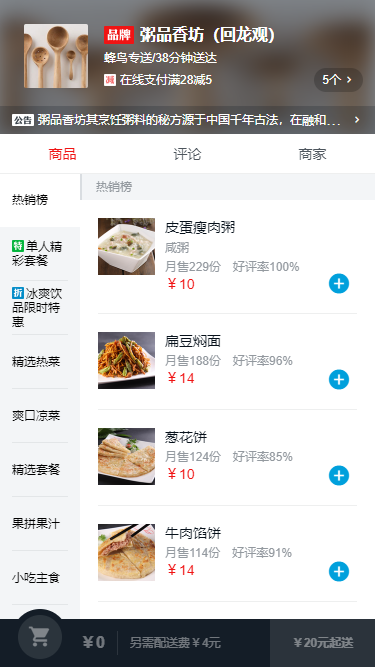
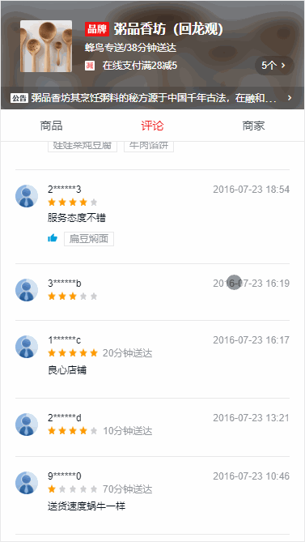
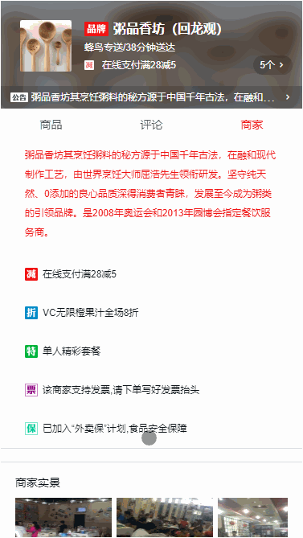

# 高仿饿了吗外卖APP

> sell app

## Build Setup

``` bash
# install dependencies
npm install

# serve with hot reload at localhost:8080
npm run dev

# build for production with minification
npm run build

```

## dependencies

```
"better-scroll": "^1.11.1",
"express": "^4.16.3",
"vue": "^2.5.2",
"vue-resource": "^1.5.1",
"vue-router": "^3.0.1"
```

## Design sketch

<p align="center">
  
  
  
  
</p>